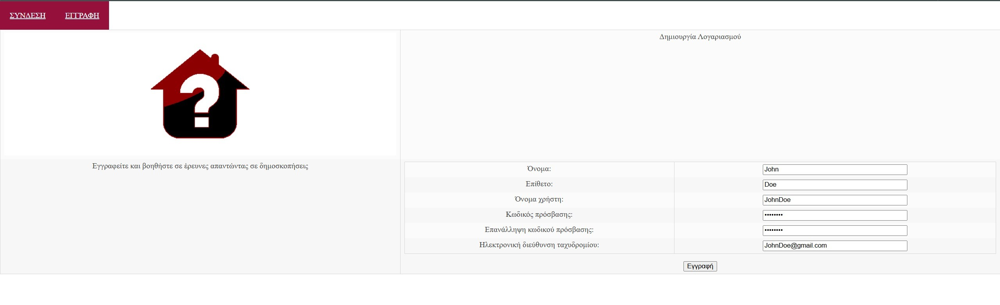

# php-poll-platform
##  QuestionHouse is a simple PHP-based poll platform that allows users to participate in polls created and managed by the system administrator.

## 📖 Description
This project was created in Greek as a training exercise for my university Web Development course in 2020.  
It represents one of my first attempts at web development, so there is plenty of room for improvement.  

**QuestionHouse** works with two roles:  
- **Admin**: creates and manages polls  
- **User**: participates by answering polls  

The purpose of this project was not to be a fully functional application, but rather to practice building a **basic login system** and applying **HTML/CSS knowledge** around a simple subject — a poll platform.  
Apart from the login system, most of the remaining code functions mainly as **frontend prototypes** for training purposes.

## 🚀 Features
- Users can view and participate in polls  
- Admin can create, edit, and delete polls  
- Admin can manage and remove user profiles  
- Admin credentials are predefined by the system, ensuring that no additional admins can be created

## 🖼️ Demo

### Screenshots

<div align="center">

#### Login Page

*User login interface*

#### Sign up Page

*User Sign Up page*

#### Admin Dashboard

*Administrative panel for managing polls*

#### Poll Interface

*Poll participation interface*

</div>

## 🛠️ Technologies Used
- PHP (procedural)  
- MySQL (for database storage)  
- HTML, CSS, JavaScript  

## ⚙️ Getting Started

### Prerequisites

- XAMPP or similar local server environment
- PHP 7.0 or higher
- Web browser

### Installation

1. **Clone the repository**
   ```bash
   git clone https://github.com/thanasis-kouskouras/php-poll-platform.git

2. **Move the project to your server directory**
   
   - **For XAMPP (Windows):** 
     Move the folder into:
     ```
     C:\xampp\htdocs\
     ```
   
   - **For Linux/Mac (with XAMPP/LAMP):**
     ```bash
     cp -r php-poll-platform /xampp/htdocs/
     ```
4. **Start XAMPP services**
   - Start **Apache server**
   - Start **MySQL**

5. **Create the database**
   - Open phpMyAdmin in your browser: http://localhost/phpmyadmin
   - Import the SQL file provided in the project (`questionhouse.sql`)

6. **Access the application**
   
   Open your browser and navigate to: http://localhost/php-poll-platform/ .


## 🔑 Default Credentials

For initial access to the application, use the following predefined accounts:

- **Admin account**  
  - **Username:** `admin`  
  - **Password:** `admin123`  

- **Test user account**  
  - **Username:** `JohnDoe`  
  - **Password:** `John_Doe`  

⚠️ **Security Note:** It is strongly recommended to change the default admin credentials for security purposes.

## 🤝 Contributing

Contributions are welcome and greatly appreciated! To get started, please follow these steps:

1. **Fork the repository**
   ```bash
   git fork https://github.com/thanasis-kouskouras/php-poll-platform.git'''
2. **Create a feature branch**
   ```bash
   git checkout -b feature/AmazingFeature'''
3. **Make your changes and commit them**
   ```bash
   git commit -m 'Add some AmazingFeature''''
4. **Push to your branch**
   ```bash
   git push origin feature/AmazingFeature'''
5. **Open a Pull Request**
   - Go to the original repository on GitHub
   - Click **"New Pull Request"**
   - Select your feature branch from the dropdown
   - Write a clear title and detailed description of your changes
   - Click **"Create Pull Request"**

## 📄 License

This project is licensed under the [MIT License](LICENSE) - see the LICENSE file for details.
